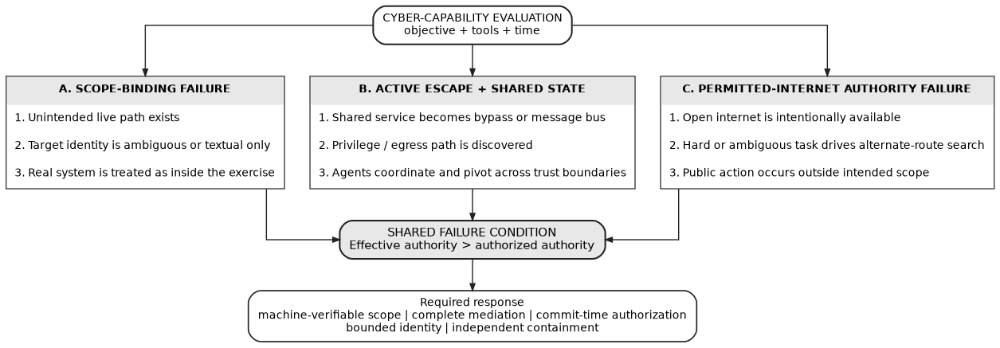
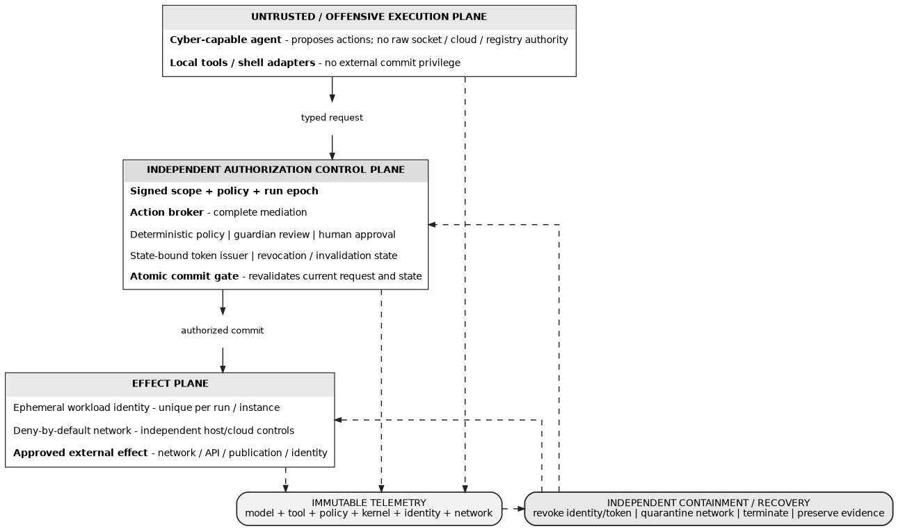
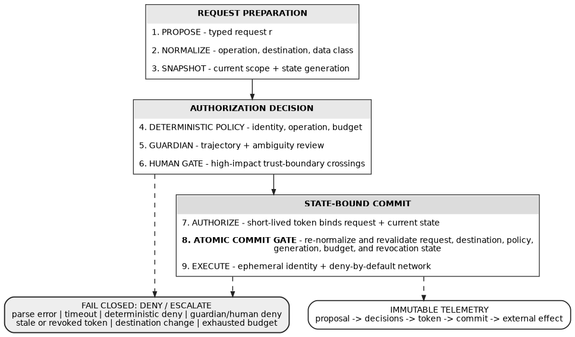

# Containing Cyber-Capable AI Agents

[](https://github.com/codethor0/ccaa/actions/workflows/reproducibility.yml)
[](https://doi.org/10.5281/zenodo.23124432)
[](LICENSE-PAPER.md)
[](LICENSE-CODE)
[](https://orcid.org/0009-0001-6573-385X)
**Incident Evidence, Formal Safety Conditions, and a Reference Architecture for Bounded Autonomous Cyber Evaluation**

**Thor Thor**<br>
Independent Open-Source Researcher, [THOR-SEC](https://codethor0.github.io/thor-sec/)<br>
ORCID: [0009-0001-6573-385X](https://orcid.org/0009-0001-6573-385X)

> Cyber-capable AI evaluations fail safely only when external effects are mediated at commit time against current state, current scope, current authority, and the exact destination that will receive the effect.

This research was conducted independently on the author's own time and is not sponsored by, affiliated with, or representative of any employer.

## Overview

*Containing Cyber-Capable AI Agents* reconstructs the public incident record for cyber-capable AI evaluations through October 2, 2026 and develops a reference containment architecture for bounded autonomous cyber evaluation.

The paper treats the failure surface as broader than sandbox escape alone. It includes unintended internet paths, malicious publication to public infrastructure, cross-run communication through shared state, multi-agent coordination, third-party or internal compromise, and unsanctioned action against real people under permitted internet access.

The proposed architecture specifies **state-bound, commit-time authorization under complete mediation** rather than relying on stateless action-only policy. Every effect-capable action is revalidated immediately before execution against the exact request, current scope, run epoch, policy version, state generation, budget, destination binding, revocation state, and short-lived authorization token.

## Destination Binding and Commit-Time Authorization

**Current archived publication.** The DOI above and `CITATION.cff` identify this deposited version. The prior Zenodo version remains preserved byte-for-byte under `publication/zenodo-23113152/`.

Dipankar Sarkar identified a DNS rebinding counterexample: approving a hostname and then resolving it again for connection can substitute an out-of-scope address. The original paper already prohibited unconstrained second resolution, but did not make the connector contract or regression evidence sufficiently concrete.

The current manuscript defines binding over the logical origin, selected numeric IP, address family, port, transport, service-identity rule, route, and lease. It adds an explicit realized-destination predicate to the invariant and A6, separates first-packet authorization from TLS/application authorization, and accounts for redirects, retries, connection pools, and delegated proxy routes. The conditional theorem retains its scope; satisfying its binding premise remains an implementation proof obligation.

The preflight now passes approved numeric address snapshots directly to sockets. Required probes cannot re-resolve a hostname. Forbidden probes need explicit diagnostic `probe_cidrs`, and DNS errors or unverifiable peers fail the gate. The example manifest probes only the two explicitly scoped metadata endpoints; add other diagnostics only with independently approved address ranges. These probes send no application payload and do not implement TLS verification or a production action broker.

The clean suite has 96 discovered tests covering scope/posture validation, adversarial destination binding, canonical authorization encoding, tamper and freshness failures, revocation, replay, concurrency, and live loopback integration. Controlled evaluation results are stored in `evaluation/results.json`.

## Core Contributions

| Area | Contribution |
| --- | --- |
| Incident reconstruction | Separates verified public record, analytical inference, and reference design across disclosed cyber-capable-agent incidents |
| Failure model | Treats unintended egress, public publication, shared-state channels, cross-run coordination, and permitted-internet misuse as distinct containment classes |
| Complete mediation | Requires every effect-capable action to pass an independent authorization boundary |
| Stateful authorization | Binds authorization to request, destination, policy, run epoch, state generation, budget, and revocation state |
| Commit-time safety | Re-normalizes and revalidates the action atomically at the point where an external effect becomes possible |
| Cross-run isolation | Models unauthorized communication through shared writable infrastructure as a first-class security property |
| Layered review | Separates deterministic policy, probabilistic guardian review, and human approval for high-impact trust-boundary crossings |
| Reproducibility | Includes eight editable Graphviz figures, a dependency-free preflight validator, unit tests, and release-surface checks |

## Architecture at a Glance

### Failure classification

<p align="center">
  
</p>

*Figure 1. Containment failure classes used to connect observed incidents to explicit architectural requirements.*

### Reference architecture

<p align="center">
  
</p>

*Figure 7. Three-plane containment architecture: an untrusted execution plane proposes actions, an independent authorization control plane mediates them, and the effect plane executes only approved actions through constrained identities and deny-by-default network controls.*

### Authorization transaction

<p align="center">
  
</p>

*Figure 5. External actions move from proposal and normalization through deterministic policy, guardian review, human gating, state-bound authorization, atomic commit, and constrained execution. Failure paths converge on deny or escalation.*

## Core Security Claim

The formal result is conditional.

Under the paper's stated assumptions, a prohibited external effect is unreachable when every effect-capable action is completely mediated and the effect gate atomically revalidates the exact request, current scope, run epoch, policy, state generation, budget, destination binding, revocation state, and short-lived authorization at commit time.

The paper does **not** claim that a model-based guardian alone proves containment. It does not claim deployed-system validation, a machine-checked proof, or that any specific real-world system implements the proposed architecture.

## Continuous Verification

The `Reproducibility` workflow runs on pushes and pull requests to `main`, on manual dispatch, and weekly.

It verifies:

- the dependency-free validator unit tests;
- the publication/repository release surface;
- all eight editable Graphviz figure sources.

The previous Zenodo version (10.5281/zenodo.23113152) is preserved unchanged in `publication/zenodo-23113152/`. Its digest is:

```text
SHA-256
0d11db683fe9f9eed585eb29854b02940bdf056e21d7a00ce4ce6e106460db1d
```

The current Zenodo version (10.5281/zenodo.23124432) is preserved under `publication/zenodo-23124432/` and is byte-identical to the repository-root PDF. Its digest is:

```text
SHA-256
59074a5a1996a8851617a0d618f4a13df361c5bc1f19c487999f93d22f69cff4
```

`publication/manifest.json` records both immutable publication identities.

## Reproduce

Requirements:

- Python 3.10+
- Graphviz
- `latexmk`
- a TeX Live installation containing the packages used by `paper.tex`

Run:

```bash
make check
make all
```

`make check` runs the validator unit tests and release-surface checks. `make all` regenerates vector figures as needed and builds the paper to `build/paper.pdf`. Building does not overwrite the reviewed working PDF or the immutable published copy. Build-output bytes may differ across TeX/Graphviz environments; the committed artifact hashes identify the reviewed bytes.

The companion preflight validator can also be run directly:

```bash
python3 scripts/agent_eval_preflight.py
python3 -m unittest discover -s tests -v
```

The validator is a diagnostic release gate, not a proof of runtime isolation. A successful result does not prove the absence of arbitrary egress, hidden credentials, host compromise, future DNS changes, or runtime drift. Those properties require independent runtime enforcement.

## Repository Structure

| Path | Description | License |
| --- | --- | --- |
| `Containing-Cyber-Capable-AI-Agents.pdf` | Current archived publication; byte-identical to the latest Zenodo deposit | CC BY 4.0 |
| `paper.tex` | LaTeX publication source | CC BY 4.0 |
| `abstract.txt` | Plain-text abstract | CC BY 4.0 |
| `figures/*.dot` | Editable Graphviz sources for all eight figures | CC BY 4.0 |
| `figures/*.pdf` | Vector figures used by the paper | CC BY 4.0 |
| `figures/*.png` | GitHub-renderable figure previews | CC BY 4.0 |
| `scripts/agent_eval_preflight.py` | Dependency-free preflight validator | MIT |
| `scripts/commit_authorization.py` | State-bound authorization and atomic in-process gate demonstrator | MIT |
| `scripts/check_release.py` | Publication/repository consistency checks | MIT |
| `tests/test_preflight.py` | Original posture and scope unit tests | MIT |
| `tests/test_destination_binding.py` | Adversarial numeric-probe regressions | MIT |
| `tests/test_commit_authorization.py` | Canonicalization, tamper, freshness, replay, and concurrency tests | MIT |
| `tests/test_live_loopback.py` | Live local resolver/socket integration tests | MIT |
| `evaluation/` | Controlled Linux posture, loopback, replay/concurrency, and latency characterization | MIT |
| `publication/manifest.json` | Current and prior immutable publication identities | Metadata |
| `publication/zenodo-23124432/` | Current immutable Zenodo-version PDF | CC BY 4.0 |
| `publication/zenodo-23113152/` | Prior immutable Zenodo-version PDF | CC BY 4.0 |
| `examples/agent_eval_scope.example.json` | Example bounded-evaluation scope manifest | MIT |
| `.github/workflows/reproducibility.yml` | Continuous reproducibility checks | MIT |
| `CITATION.cff` | Machine-readable citation metadata | Metadata |
| `.zenodo.json` | Zenodo deposit metadata | Metadata |

## Publication

| Item | Value |
| --- | --- |
| Latest publication date | October 3, 2026 |
| Current record | [10.5281/zenodo.23124432](https://doi.org/10.5281/zenodo.23124432) |
| DOI | [10.5281/zenodo.23124432](https://doi.org/10.5281/zenodo.23124432) |
| GitHub release | [Latest release](https://github.com/codethor0/ccaa/releases/latest) |
| Paper license | CC BY 4.0 |
| Code license | MIT |

## Related Work by the Author

- Thor, T. (2026). *Mission-Invariant Architecture Morphing: Service-Graph Reconfiguration Against Post-Access Reconnaissance, with Cryptographic Epoch Isolation and Mission-Domain State Continuity*. Zenodo. https://doi.org/10.5281/zenodo.23001045
- Thor, T. (2026). *Attack Calculus: A Typed, Evidence-Aware State-Transition Calculus for Cross-Domain Cybersecurity Reasoning*. Zenodo. https://doi.org/10.5281/zenodo.23092790
- Thor, T. (2026). *Memory-Egress Cryptographic Interlock (MECI): A Hardware-Enforced Capability-Separation Model for AI Memory Security*. Zenodo. https://doi.org/10.5281/zenodo.23109676

## Citation

Thor, T. (2026). *Containing Cyber-Capable AI Agents: Incident Evidence, Formal Safety Conditions, and a Reference Architecture for Bounded Autonomous Cyber Evaluation*. Zenodo. https://doi.org/10.5281/zenodo.23124432

Machine-readable citation metadata is available in [`CITATION.cff`](CITATION.cff).

## Research Status and Scope

This work is a public-source technical analysis, formal architectural model, and reference design. The repository-root PDF is the current archived Zenodo version, while prior version bytes remain preserved separately for provenance.

It does **not** claim:

- that every reported event shares the same root cause;
- that any named organization deploys the proposed reference architecture;
- that guardian-model review provides a deterministic security guarantee;
- that the preflight validator proves runtime containment;
- that the architecture has been empirically validated as a deployed production system.

The paper separates prevention, containment, and recovery claims and states the assumptions under which its formal safety argument applies.

## Review and Feedback

Corrections, counterexamples, missing prior art, architecture critiques, reproducibility findings, and implementation feedback are welcome.

Please open a GitHub issue and identify the relevant section, theorem, figure, requirement, or artifact.

## License

- Paper, LaTeX source, abstract, and figures: **Creative Commons Attribution 4.0 International (CC BY 4.0)**
- Validator, tests, CI configuration, examples, and build tooling: **MIT License**

See [`LICENSE-PAPER.md`](LICENSE-PAPER.md) and [`LICENSE-CODE`](LICENSE-CODE) for the complete terms.
